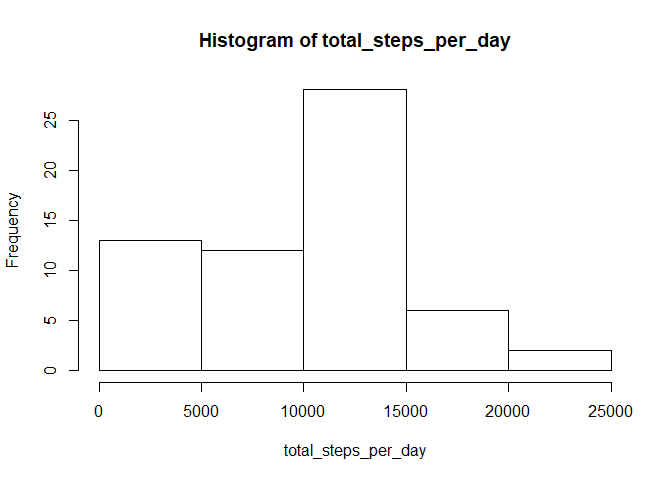
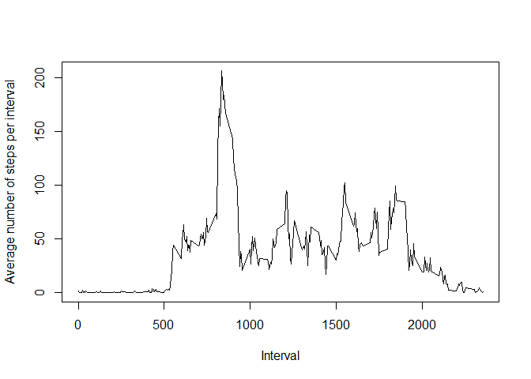
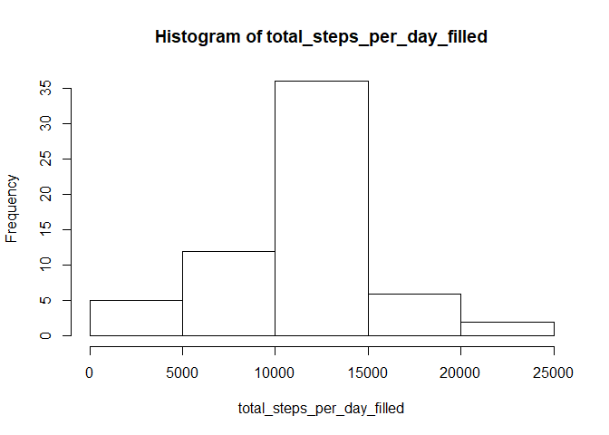
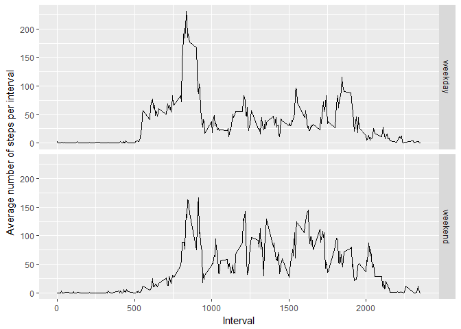

## Loading and preprocessing the data

```r
library(dplyr, quietly = TRUE)
```

```
## 
## Attaching package: 'dplyr'
```

```
## The following objects are masked from 'package:stats':
## 
##     filter, lag
```

```
## The following objects are masked from 'package:base':
## 
##     intersect, setdiff, setequal, union
```

```r
library(ggplot2)
unzip("activity.zip")
data <- read.csv("activity.csv")
data$date <- as.Date(as.character(data$date), "%Y-%m-%d")
```


## What is mean total number of steps taken per day?

```r
total_steps_per_day <- with(data, tapply(steps, date, sum, na.rm=TRUE))
hist(total_steps_per_day)
```

<!-- -->

```r
summary(total_steps_per_day)
```

```
##    Min. 1st Qu.  Median    Mean 3rd Qu.    Max. 
##       0    6778   10395    9354   12811   21194
```


## What is the average daily activity pattern?

```r
avg_steps_per_interval <- with(data, tapply(steps, interval, mean, na.rm=TRUE))
plot(names(avg_steps_per_interval), avg_steps_per_interval, type="l", xlab="Interval", ylab="Average number of steps per interval")
```

<!-- -->

```r
max_value <- max(avg_steps_per_interval)
max_interval <- names(which.max(avg_steps_per_interval))
```
The interval 835 contains the maximum number of steps (206.1698113), on average across all the days in the dataset.

## Imputing missing values
Total number of missing values

```r
sum(is.na(data))
```

```
## [1] 2304
```
Fill missing values by taking the average number of steps in the corresponding interval

```r
data_filled <- data %>% 
  group_by(interval) %>% 
  mutate(avg = mean(steps, na.rm=TRUE), 
         steps = ifelse(is.na(steps), avg, steps))
```
Summary of filled data

```r
total_steps_per_day_filled <- with(data_filled, tapply(steps, date, sum))
hist(total_steps_per_day_filled)
```

<!-- -->

```r
summary(total_steps_per_day_filled)
```

```
##    Min. 1st Qu.  Median    Mean 3rd Qu.    Max. 
##      41    9819   10766   10766   12811   21194
```
Yes, mean and median are differing from the first part of the assignement.
Both values are higher than before.

The total daily numbers of stepsare  now higher than before, since there are more values per day. The histogram shows that: in the previous plot there have been more low values than in the current plot.

## Are there differences in activity patterns between weekdays and weekends?

```r
data_filled$weekday <- factor(weekdays(data_filled$date), levels=c("Montag", "Dienstag", "Mittwoch", "Donnerstag", "Freitag", "Samstag", "Sonntag"), ordered=TRUE)
data_filled$daytype <- NA
data_filled[data_filled$weekday >= "Samstag","daytype"] <- "weekend"
data_filled[data_filled$weekday < "Samstag","daytype"] <- "weekday"
data_filled$daytype <- as.factor(data_filled$daytype)

avg_steps_per_interval_filled <- data_filled %>% 
  group_by(daytype, interval) %>% 
  summarise(avg=mean(steps))
```


```r
ggplot(avg_steps_per_interval_filled, aes(x=interval, y=avg)) + 
  facet_grid(daytype ~ .) + 
  geom_line() + 
  xlab("Interval") + 
  ylab("Average number of steps per interval")
```

<!-- -->

Yes there are differnces on weekend and weekday. On weekend the average step number rises earlier and the peak in the morning is higher.
